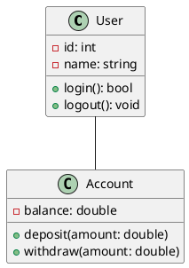

# Software Architecture Fundamentals

## Key Principles

### SOLID Principles
- Single Responsibility Principle (SRP)
- Open/Closed Principle (OCP)
- Liskov Substitution Principle (LSP)
- Interface Segregation Principle (ISP)
- Dependency Inversion Principle (DIP)

### Design Patterns
```java
// Singleton Pattern
public class Singleton {
    private static Singleton instance;
    
    private Singleton() {}
    
    public static Singleton getInstance() {
        if (instance == null) {
            instance = new Singleton();
        }
        return instance;
    }
}

// Factory Pattern
public interface Animal {
    void makeSound();
}

public class AnimalFactory {
    public Animal createAnimal(String type) {
        if ("dog".equals(type)) {
            return new Dog();
        } else if ("cat".equals(type)) {
            return new Cat();
        }
        return null;
    }
}
```

### Architectural Styles
1. Layered Architecture
2. Event-Driven Architecture
3. Microservices Architecture
4. Service-Oriented Architecture (SOA)
5. Space-Based Architecture

## System Components

### Presentation Layer
```typescript
interface UserInterface {
    displayData(data: any): void;
    handleUserInput(input: string): void;
    updateView(): void;
}
```

### Business Layer
```java
public class BusinessService {
    private DataAccess dataAccess;
    
    public BusinessService(DataAccess dataAccess) {
        this.dataAccess = dataAccess;
    }
    
    public void processBusinessLogic() {
        // Implementation
    }
}
```

### Data Layer
```python
class DataRepository:
    def __init__(self, connection):
        self.connection = connection
    
    def save(self, entity):
        # Save to database
        pass
    
    def retrieve(self, id):
        # Get from database
        pass
```

## Quality Attributes

### Scalability
- Horizontal scaling
- Vertical scaling
- Load balancing

### Performance
- Response time
- Throughput
- Resource utilization

### Security
- Authentication
- Authorization
- Data encryption

### Reliability
- Fault tolerance
- Error handling
- Data backup

## Architecture Documentation

### Views and Perspectives
1. Logical View
2. Process View
3. Development View
4. Physical View
5. Scenarios

### UML Diagrams


## Best Practices

### Code Organization
```
src/
├── main/
│   ├── java/
│   │   └── com/
│   │       └── example/
│   │           ├── controllers/
│   │           ├── services/
│   │           └── repositories/
│   └── resources/
└── test/
```

### Dependency Management
```xml
<dependencies>
    <dependency>
        <groupId>org.springframework</groupId>
        <artifactId>spring-core</artifactId>
        <version>${spring.version}</version>
    </dependency>
</dependencies>
```

### Error Handling
```python
try:
    process_data()
except DataException as e:
    logger.error(f"Data processing error: {e}")
    raise BusinessException("Unable to process data")
finally:
    cleanup_resources()
```

## Architecture Decision Records (ADR)

### Template
```markdown
# Title: [Short title of solved problem and solution]

## Status
[Proposed | Accepted | Deprecated | Superseded]

## Context
[Description of the problem and context]

## Decision
[Description of the decision made]

## Consequences
[Description of the consequences of the decision]
```

## Testing Strategies

### Unit Testing
```python
def test_user_creation():
    user = User("John", "john@example.com")
    assert user.name == "John"
    assert user.email == "john@example.com"
```

### Integration Testing
```java
@Test
public void testUserService() {
    UserService service = new UserService(repository);
    User user = service.createUser("John", "john@example.com");
    assertNotNull(user.getId());
}
```

## Deployment Considerations

### Infrastructure
```yaml
# Docker Compose configuration
version: '3'
services:
  web:
    build: .
    ports:
      - "8080:8080"
  db:
    image: postgres
    environment:
      POSTGRES_PASSWORD: example
```

### Monitoring
```python
def monitor_health():
    metrics = {
        'cpu_usage': get_cpu_usage(),
        'memory_usage': get_memory_usage(),
        'active_connections': get_active_connections()
    }
    return metrics
```

*Last updated: 2025-08-10 11:11:52 UTC*